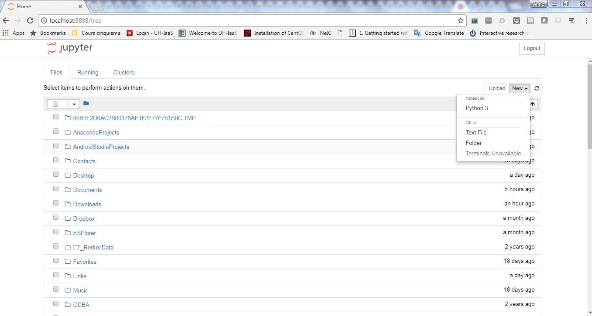
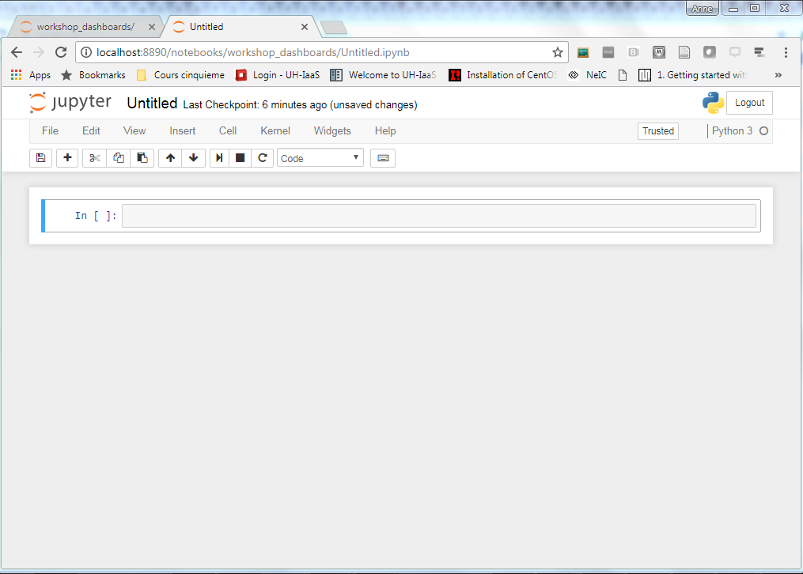
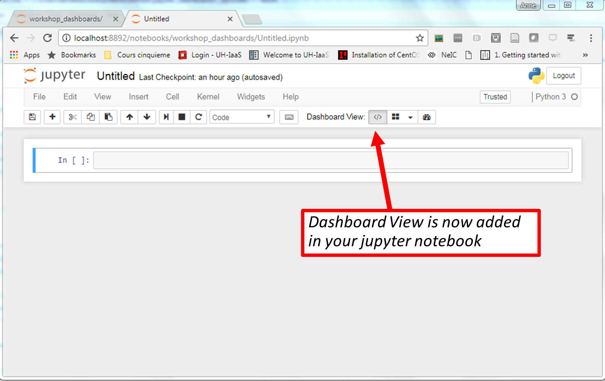

# What is a jupyter notebook?

Jupyter notebook, formerly known as [IPython](https://ipython.org/) notebook (or Interactive Python), is a flexible and powerful open source research tool that can help you keep a narrative of your coding process. The name Jupyter is an acronym of the three core languages it was designed for: [JUlia](https://julialang.org/), [PYThon](https://www.python.org/), and [R](https://www.r-project.org/). Project Jupyter supports interactive data science and scientific computing across more than 40 programming languages.

https://jupyter.org/

## Jupyter as Coding Diary

You can think of the notebook as a lab or field diary that keeps a detailed record of the steps you take as you develop scripts and programming workflows. Just as you would with a field notebook, it is important to develop good note-taking habits. This workshop is designed to impart a set of skills, tools, and best practices you can implement in your own research to enhance reprodubility, which will make modifications, collaboration, and publishing easier.

## Jupyter Architecture

Jupyter is comprised of several components, some of which the user doesn't directly interact with, but should at least be aware of. On the **front-end**, the user will work with the:

1. **Web Application:** Browser-based tool for interactive development of notebook documents
2. **Notebook Document:** A representation of all content visible in the web application, including inputs and outputs of the computations, explanatory text, mathematics, images, and rich media representations of objects. These documents are internally JSON files and are saved with the .ipynb extension. Since JSON is a plain text format, they can be version-controlled and shared with colleagues.

Jupyter also has some **back-end** processes, including the:

3. **Kernel:** A separate process responsible for running user code. For the purposes of this workshop, we will be working on Python kernels, although Jupyter is capable of interfacing with other programming languages as well.
4. **Notebook Server:** Communicates with kernel and routes the Python programming language to the web browser.

## Jupyter Ecosystem
There has been considerable development by both Project Jupyter and external collaborators that have yielded a multitude of options for Jupyter users. This diagram gives a sample of some of the possibilities.

## Launch Jupyter notebook App

Make sure you installed [Anaconda python 3.6](https://www.anaconda.com/download/) and [Anaconda navigator](https://anaconda.org/anaconda/anaconda-navigator) along with all the additional python packages we will be using for this lesson. For more information read and follow the [setup instructions](https://annefou.github.io/jupyter_dashboards/setup.html) for this lesson.

### Start jupyter notebook

We want to start a new jupyter notebook using our newly created conda environment. To select "jupyter_dashboards_workshop" conda environment:

- Click on "Home" (left menu)
- Select "jupyter_dashboards_workshop" in "Applications on"
- Launch jupyter notebook ("Launch" button)

Jupyter starts in your default browser at the address [http://localhost:8888/tree](http://localhost:8888/tree) and shows the tree (directories) from the root directory (here is root directory is to be understood from the installation location of Anaconda). It may vary from one laptop to another but you should not worry about it.

When clicking on "New" (right hand side) as shown on the Figure below:

 You should be able to select:
- **Folder**: to create a new folder
- rename it "workshop_dashboards": select it (tick box) and click on "rename". A new window should pop up where you can enter the new name for your Folder.
- Click on "workshop_dashboards" to enter the newly created directory
- Click on "New" but this time select "Notebook" Python 3

For now, the most important is to be able to start a new jupyter notebook. We will now look into jupyter dashboards and we will learn more about jupyter notebook/dashboard later in this lesson.

> ## Default browser
>  You may need to change the default browser for starting your jupyter notebook. All the examples in this lesson have been tested with [Google chrome](https://www.google.com/chrome/browser/desktop/index.html?brand=CHBD&gclid=CjwKCAiA15vTBRAHEiwA7Snfc8Ly7Kz3VH-sKSABkCHsiAhviP1ZJzyzV5wUPasjHs27d_0PcESFkhoCOskQAvD_BwE)
{: .callout}

# What is a Jupyter Dashboard?

A jupyter dashboard is very much like a jupyter notebook but thanks to the dashboards layout extension you can arrange your notebook outputs (text, plots, widgets, etc.) in a grid - or report-like layouts. The layouts are saved in your notebook document so the layouts can be shared too.

Don't worry if you do not understand all the details now (for instance if you don't know what are widgets, what we mean by grid layouts). For now our goal is to check if the dashboards layout extension works properly on your laptop.

In your newly created jupyter notebook, you should have the dashboard view extension:

# Why are Jupyter Notebooks/dashboards a powerful tool for conducting reproducible research?

We have chosen in this lesson to use [Jupyter dashboards](https://jupyter-dashboards-layout.readthedocs.io/en/latest/) and the [Python language](https://www.python.org/) to demonstrate how reproducibility of research work can be improved.

The main advantages of both Jupyter notebook/dashboard and python are:

- Free!
- Open source
- Widely used and supported across many disciplines ([stackoverflow](https://stackoverflow.com/), blogs, examples, tutorials, etc.)
- Can be used on most Operating System such as Windows, Mac OS X, or Linux!
- Jupyter notebook/dashboard supports a <a href="https://github.com/jupyter/jupyter/wiki/Jupyter-kernels">**large number of programming languages**</a>.

Jupyter Notebooks/dashboards are great because they **facilitate**:

* **Documentation and literate programming** by combining rich-text narrative *concepts* & machine-readable *code*. The notebeook itself is a data-structure with metadata that can be easily read and parsed.
* **Exploration & development**: Intermediate steps are saved in a clean, well documented format
* **Communication/Collaboration**: sharing research with peers, collaborators, reviewers, public
* **Publishing**: It is simple and quick switch between the development & publishing stage

# Knowing your way around jupyter dashboard

The Jupyter Notebook is a web application that allows you to create and share documents that contain live code, equations, visualizations and explanatory text. The following links may be useful in gaining a basic understanding of Jupyter and how to work in Jupyter notebook:
1. [http://jupyter.org/about.html](http://jupyter.org/about.html): general information about Jupyter
2. [https://jupyter-notebook-beginner-guide.readthedocs.io/en/latest/execute.html](https://jupyter-notebook-beginner-guide.readthedocs.io/en/latest/execute.html): starting guide
3. [http://nbviewer.jupyter.org/github/jupyter/notebook/blob/master/docs/source/examples/Notebook/Notebook%20Basics.ipynb](http://nbviewer.jupyter.org/github/jupyter/notebook/blob/master/docs/source/examples/Notebook/Notebook%20Basics.ipynb): notebook basics

If this is your first time using Jupyter, start with taking a tour of the user interface:
* Click on the menu Help -> User Interface Tour
* Scroll over each of the tabs in the menu to see the options. They should be fairly straightforward.

Here are some other helpful tips and shortcuts:
* You can run the notebook document step-by-step (one cell a time) by pressing shift + enter.
* You can run the whole notebook in a single step by clicking on the menu Cell -> Run All.
* To restart the kernel (i.e. the computational engine), click on the menu Kernel -> Restart. This can be useful to start a computation over from scratch (e.g. variables are deleted, open files are closed, etc...).

## Cell Types
Cells are designated as Code, Markdown, or Raw NBConvert (Notebook Conversion). To switch from one type to another, click on Cell -> Cell Type.

Throughout our tutorials, we will mainly be working in code cells to learn how to use Python. However, each of the tutorials include Markdown cells to provide introductions and learning objectives for each tutorial, background information, and instructions throughout. We encourage you to open these markdown cells to become familiar with the syntax, and add markdown notes as you see fit. Learning to use Markdown and Notebook Conversion cells will become a useful skill for Python scripts and notebooks you will use in your future research. Throughout this data institute, you will learn to use the full set of Jupyter Notebook tools for conducting reproducible (and publishable) research.

### Code
Code cells are where we will write and execute our Python scripts and functions.

### Markdown
Markdown cells are mainly used to neatly document the code that is written in Jupyter notebooks. While this course does not focus on Markdown, we encourage you to explore the Markdown capabilities, and add Markdown cells to your notebooks as you see fit. Some useful resources for learning Markdown Syntax include:
1. Markdown Cheatsheet: [http://nestacms.com/docs/creating-content/markdown-cheat-sheet](http://nestacms.com/docs/creating-content/markdown-cheat-sheet)
2. [https://ipython.org/ipython-doc/3/notebook/notebook.html#markdown-cells](https://ipython.org/ipython-doc/3/notebook/notebook.html#markdown-cells)
3. Example Markdown Notebook: [http://nbviewer.jupyter.org/github/ipython/ipython/blob/1.x/examples/notebooks/Part%204%20-%20Markdown%20Cells.ipynb](http://nbviewer.jupyter.org/github/ipython/ipython/blob/1.x/examples/notebooks/Part%204%20-%20Markdown%20Cells.ipynb)

### NBConvert - Notebook Conversion

The NBConvert tool allows you to convert a Jupyter .ipynb notebook document file into another format. The nbconvert documentation contains a complete description of this tool's capabilities:
[https://media.readthedocs.org/pdf/nbconvert/latest/nbconvert.pdf](https://media.readthedocs.org/pdf/nbconvert/latest/nbconvert.pdf). The description below, copied from the document, gives a brief overview of the tool:

Using nbconvert enables:
* presentation of information in familiar formats, such as PDF.
* publishing of research using LaTeX and opens the door for embedding notebooks in papers.
* collaboration with others who may not use the notebook in their work.
* sharing contents with many people via the web using HTML.

Overall, notebook conversion and the nbconvert tool give scientists and researchers the flexibility to deliver information
in a timely way across different formats.

Primarily, the nbconvert tool allows you to convert a Jupyter .ipynb notebook document file into another static
format including HTML, LaTeX, PDF, Markdown, reStructuredText, and more. The nbconvert tool can also add productivity
to your workflow when used to execute notebooks programmatically.

If used as a Python library (import nbconvert), nbconvert adds notebook conversion within a project. For
example, nbconvert is used to implement the “Download as” feature within the Jupyter Notebook web application.
When used as a command line tool (invoked as jupyter nbconvert ...), users can conveniently convert just
one or a batch of notebook files to another format.

> ## Use nbconvert to export your Jupyter dashboard/notebook
>
> - Create a new text cell in your notebook
> - Download it as HTML i.e. Select File --> Download as HTML (.html)
> - View the newly created HTML file with your browser
>
>
> > ## Solution
> > Be aware that by default you can't save your notebook in all the listed formats.
> > For instance to download your notebook as a LaTeX file, you need to install latex on your laptop.
> > To unlock nbconvert’s full capabilities, nbconvert requires Pandoc and TeX (specifically, XeLaTeX).
> > These must be installed separately.
> {: .solution}
{: .challenge}

## Jupyter Notebook tips, tricks, and shortcuts

This link has some useful tips that may come in handy in your research:
[https://www.dataquest.io/blog/jupyter-notebook-tips-tricks-shortcuts/](https://www.dataquest.io/blog/jupyter-notebook-tips-tricks-shortcuts/)

### Display variables with %whos

Since the Jupyter notebook doesn't have a separate window to display the variables that have been generated, we can use the commands %who, %who_ls, or %whos to show a complete list of imported modules, functions, variables, and other outputs (eg. figures). The command %who lists the variable names in row format, %who_ls lists the variable names in column format, and %whos is the most comprehensive, displaying variable name, type, and data/info. Remember this tool throughout the following tutorials if you need to check whether a module or function was already imported, a variable created, etc.

~~~
# Display variables & imported modules
%whos
~~~
{: .language-python}

# Get familiar with Jupyter notebooks

To familiarise participants with the notebook environment, build up a simple notebook from scratch demonstrating the following operations:

- Insert & delete cells
- Change cell type (& know different cell types)
- Run a single cell from taskbar & keyboard shortcut (shift + Enter)
- Run multiples cells, all cells
- Re-order cells
- Split & merge cells
- Stop a cell

See [Navigating jupyter notebook instructions for instructors](https://github.com/annefou/jupyter_dashboards/blob/gh-pages/notebooks/navigating_the_notebook-instructor_script.ipynb) for reference.

# Documentation and references

## Curious to learn more? Refer to these Jupyter documents:

- [Jupyter notebook documentation](http://jupyter-notebook.readthedocs.io/en/latest/notebook.html)
- [Jupyter architecture](http://jupyter.readthedocs.io/en/latest/architecture/how_jupyter_ipython_work.html)
- [Jupyter dashboards](https://jupyter-dashboards-layout.readthedocs.io/en/latest/)

## You are not alone! There are many resources for `Jupyter Notebooks` and `Python`:

#### `Project Jupyter`

- `Project Jupyter` [Homepage](http://jupyter.org/)
- `Project Jupyter` [Google group](https://groups.google.com/forum/#!forum/jupyter)
- `Jupyter` [documentation](https://jupyter.readthedocs.io/en/latest/)
- [GitHub](https://github.com/jupyter/help)
- Free `Project Jupyter` tutorials:
    - [Readthedocs](https://jupyter-notebook-beginner-guide.readthedocs.io/en/latest/)
    - [YouTube](https://www.youtube.com/watch?v=Rc4JQWowG5I)

#### `Python`

- [`Python`](https://www.python.org/)
- `Python` [documentation](https://docs.python.org/3/)
- `Python` [Google group](https://groups.google.com/forum/#!forum/comp.lang.python) - Note, there are many!
- [Stack Overflow](http://stackoverflow.com/questions/tagged/python)
- `Python` [Help](https://www.python.org/about/help/)
- Free `Python` tutorials:
    - [Google's Python tutorial](https://developers.google.com/edu/python/)
    - [Data Camp](https://www.datacamp.com/)
    - [Berkeley Institute for Data Science Python Boot Camp](https://www.youtube.com/playlist?list=PLKW2Azk23ZtSeBcvJi0JnL7PapedOvwz9)
