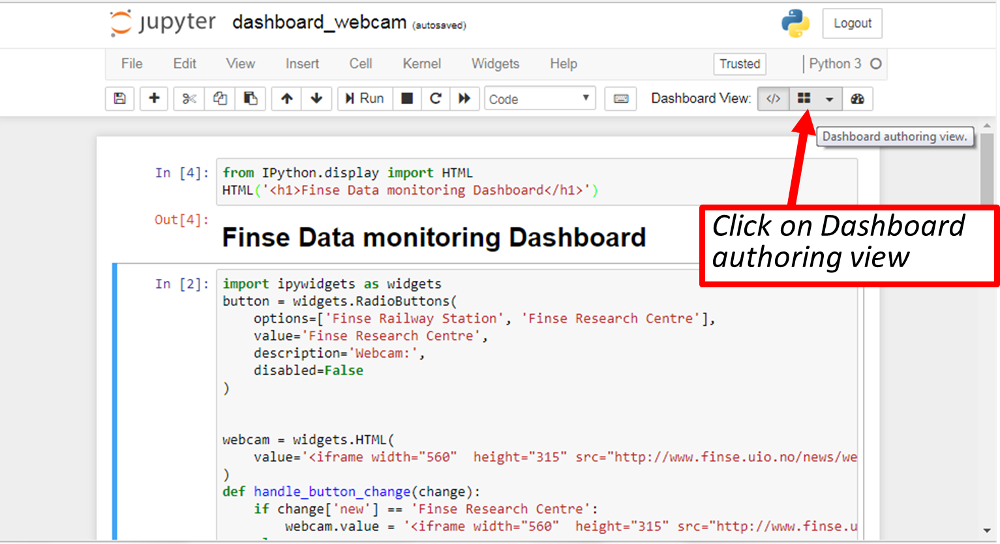
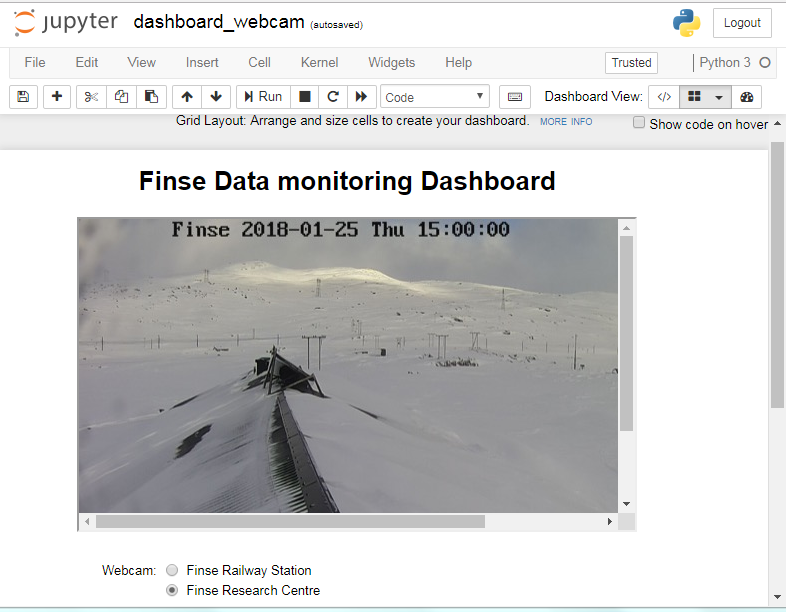
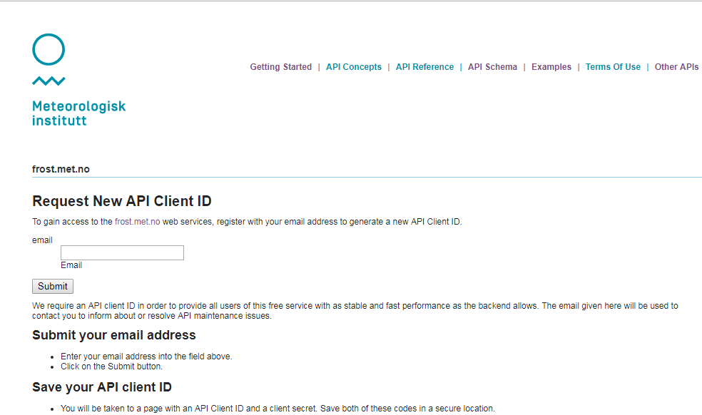
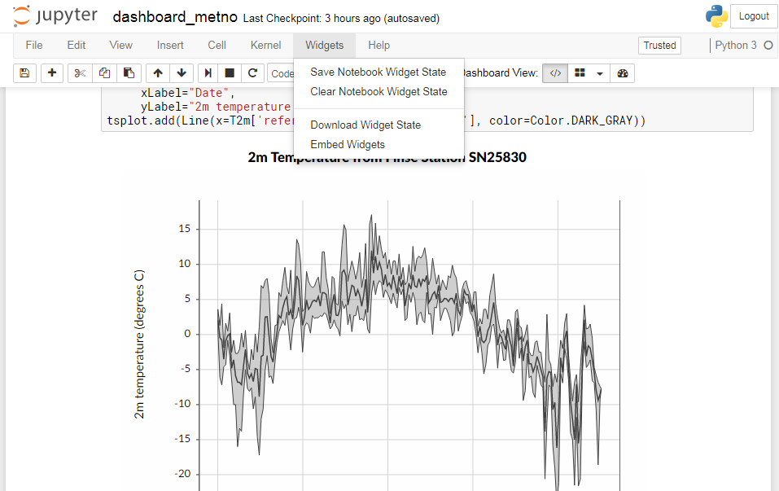

# Storyline

Laura has just started her PhD program as part of the [Land-Atmosphere Interaction in Cold Environments](http://www.mn.uio.no/geo/english/research/groups/latice/) (LATICE) project at University of Oslo, Department of Geosciences, Norway. She is interested in exploring
field data from the [Finse Research Centre](http://finse.uio.no). [Finse Alpine Research Center](http://finse.uio.no) is located in the northwestern part of the Hardangervidda mountain plateau and is of great interest for scientists in particular biologists, geologists, geophysicists.

In addition to field data from Finse Research Centre, Laura wishes to use data from other Weather Stations available freely available from [the Norwegian Meteorological Institute](https://www.met.no/en). She would need to clearly identify in her plots the data sources (Meteorological Institute or Finse Research Stations).

A large variety of data is therefore available to her and Laura would like to create the following outputs to better understand her project and show what [Finse Research Centre](http://finse.uio.no) is about:

- Stream web camera from Finse railway station and show the last image taken from the Finse Research Centre
-  Regularly create a map with temperature values (in degrees Celcius) from Weather Stations available from the Norwegian Meteorological Institute in the "Finse" region (Finse region at large)
- Add temperature values from Finse Research Stations with a different color to clearly distinguish Norwegian Meteorological Institute data from Finse Research Stations.
-  On the same map, allow users to select the variable to plot (temperature, wind direction, wind speed, relative humidity, pressure, etc.).
- Create a summary table for Norwegian Meteorological stations and Finse Research Centre Stations
- Allow user to select a station (by clicking) and show on another plot historical data (timeserie) where the user can select the start and end date.
- Show information on the battery of all Finse Research Stations. This will allow Laura to monitor the status of each stations (when the battery is down, she cannot receive data).

# Stream web camera

Laura can get live images from [Finse railway station](http://www.bt.no/tv/embed/?id=100521) and there is also a webcam on the roof of [Finse Research Centre](http://www.finse.uio.no/news/webcam/) (updated every hour between 6am and 6pm). The main purpose of the camera is to make it possible for researchers to follow the snow melt-off in the spring.

Laura needs to:

- Display the last available image from [Finse Research Centre](http://www.finse.uio.no/news/webcam/)
- Livestream [Finse railway station](http://www.bt.no/tv/embed/?id=100521)

Since we are viewing our jupyter notebook in a web browser, we can also render HTML content directly in the notebook. In fact, you can return virtually anything:

- image
- audio
- video

~~~
from IPython.display import HTML

HTML('<iframe width="560"  height="315" src="http://www.finse.uio.no/news/webcam/dagens.jpg"></iframe>')
~~~
{: .language-python}

<figure>
 
	<figcaption><i> Most recent picture (updated every hour between 6am and 6pm) from Finse Research Centre 
	Source: http://www.finse.uio.no/news/webcam</i>
	</figcaption>
</figure>

A string is passed within `HTML` and you need to use `HTML` (Hyper Text Markup Language) syntax.  HTML is the standard markup language for creating Web pages and an in-depth description of this language is out of scope now.

And here we use iframe HTML tag. An iframe is used to display a web page within a web page and this is what we
do here as we display the entire webpage [http://www.finse.uio.no/news/webcam/dagens.jpg](http://www.finse.uio.no/news/webcam/dagens.jpg).

We also added the size (width and height) of our webpage (size we want to have in our jupyter notebook).

For more information on how to include webpage in HTML using ifram tag, look [here](https://www.w3schools.com/html/html_iframe.asp).

## Stream web camera

We apply the very same recipe to display the livestream camera from Finse Railway station:

~~~
from IPython.display import HTML
HTML('<iframe width="560"  height="315" src="http://www.bt.no/tv/embed/?id=100521" allowfullscreen="true"></iframe>')
~~~
{: .language-python}

Here we display the entire webpage [http://www.bt.no/tv/embed/?id=100521](http://www.bt.no/tv/embed/?id=100521).

## Select camera with python interactive widget

Laura does not want to display both webcam images at the same time and would like users to be able to choose which one to display. Therefore we need to interact with our notebook and be able to choose between:

- Finse Research Centre webcams
- Finse Railway Station livestream

Let's use python interactive widgets.  To make use of Selection widgets, we need to install `ipywidgets` python package.

Follow the instructor and install `ipywidgets` in `jupyter_dashboards` environment through **Anaconda Navigator**.

Then in your jupyter notebook:

~~~
import ipywidgets as widgets
~~~
{: .language-python}

> ## Use your sticky note
>  Use a **green sticky note** to signal that you have successfully installed this package
> or the **red sticky note** if you encountered any problems.
{: .callout}

Now let's try different Selection widgets:

~~~
select = widgets.Select(
    options=['Finse Railway Station', 'Finse Research Centre'],
    value='Finse Research Centre',
    rows=2,
    description='Webcam:',
    disabled=False
)

display(select)
~~~
{: .language-python}

~~~
radio = widgets.RadioButtons(
    options=['Finse Railway Station', 'Finse Research Centre'],
    value='Finse Research Centre',
    description='Webcam:',
    disabled=False
)

display(radio)
~~~
{: .language-python}

> ## How to display several widgets in the same cell
>  We used `display` to show our widget. You can pass more than one widget to display all of them in the same cell:
> ~~~
> select = widgets.Select(
>    options=['Finse Railway Station', 'Finse Research Centre'],
>    value='Finse Research Centre',
>    rows=2,
>    description='Webcam:',
>    disabled=False
> )
>
> radio = widgets.RadioButtons(
>    options=['Finse Railway Station', 'Finse Research Centre'],
>    value='Finse Research Centre',
>    description='Webcam:',
>    disabled=False
> )
>
> display(select, radio)
> ~~~
> {: .language-python}
{: .callout}

Many more types of "[Selection widgets](http://ipywidgets.readthedocs.io/en/stable/examples/Widget%20List.html#Select)" can be used. Have a look at the [documentation](http://ipywidgets.readthedocs.io/en/stable/examples/Widget%20List.html#Select) to get more information.

Laura is quite happy with Radiobuttons. Now we need to display the proper webcam when a user select Finse Railway station or Finse Research Centre. The easiest way to do it is to define another widget to display HTML and to link the radiobutton widget with the HTML widget.

Let's first see how to define an HTML widget:

~~~
webcam = widgets.HTML(
    value='<iframe width="560"  height="315" src="http://www.finse.uio.no/news/webcam/dagens.jpg"></iframe>',
    description='Finse Research Centre',
)

display(webcam)
~~~
{: .language-python}

In `value`, you need to pass HTML code, same as we did before.

<figure>
 
</figure>

To handle changes, widgets have a method (function) called `observe` which can be used to register a callback function.

 A callback function is a function which is:
- passed as an argument to another function, and,
- is invoked after some kind of event.

 Remember our widget `button`. When calling its method `observe`, we would like to call another function `handle_button_change`. This function will modify the value of our second widget `webcam` depending on the value of the widget button:

~~~
button = widgets.RadioButtons(
    options=['Finse Railway Station', 'Finse Research Centre'],
    value='Finse Research Centre',
    description='Webcam:',
    disabled=False
)

webcam = widgets.HTML(
    value='<iframe width="560"  height="315" src="http://www.finse.uio.no/news/webcam/dagens.jpg"></iframe>',
)

def handle_button_change(change):
    if change['new'] == 'Finse Research Centre':
        webcam.value = '<iframe width="560"  height="315" src="http://www.finse.uio.no/news/webcam/dagens.jpg"></iframe>'
    else:
        webcam.value = '<iframe id="iframe" width="560"  height="315" src="http://www.bt.no/tv/embed/?id=100521" allowfullscreen="true"></iframe>'

button.observe(handle_button_change, names='value')

display(webcam, button)
~~~
{: .language-python}

The name of the callback `handle_button_change` is arbitrary and can be changed but the same name needs to be passed to `observe` method of `button` widget.

## From jupyter notebook to jupyter dashboard

Let's first add a title to our jupyter notebook. There are different ways to do; for instance:
- change the cell type to Markdown
- Create HTML text

> ## Add a title
>
> - Create a new cell above our widgets cell
> - Change its type to Mardown
> - Add a title `Finse Data monitoring Dashboard`
>
{: .challenge}

Let's do it by display HTML:

~~~
from IPython.display import HTML
HTML('<h1>Finse Data monitoring Dashboard</h1>')
~~~
{: .language-python}

Now go to the `dashboard View` and click on `dashboard Authoring View` as shown on the figure below:

Move your cells to get your title at the top and in the middle and display webcams below. Save your dashboard and close it (`Close and Halt`). Reopen it and check your dashboard layout has been restored properly (you need to execute each cell and then select `dashboard view`).

When selecting `dashboard view` the code "disappears" and you should see the cell outputs only. You also have a button at the top right `Show code on hover` which you can activate or not to show the code.

At the bottom of your dashboard, you should see `Hidden Cells`. We are not using them rigth now but the idea is to have the possibility to hide the output of some cells; for instance, cells we can use to compute intermediate results but are not useful to be displayed.

Use your **green** sticky note when ready or **red** sticky note if you have any problems.

# Create an interactive map for plotting geospatial data

## Requirements

We need to install the following python packages:
- folium

> ## Install folium using Anaconda navigator
>
> - Remember how we installed jupyter_dashboards and jupyter_dashboards_bundlers python packages in our environment jupyter_dashboards and
> follow the same instructions to install folium
> Use a **green sticky note** to signal that you have successfully installed this package
> or the **red sticky note** if you encountered any problems.
>
> - Test your newly installed package
>
> > ## Solution
> > Open Anaconda Navigator, click on "Environments"
> > Make sure you select the right working environmment "jupyter_dashboards"
> > Select "Not installed" and search for folium and install it
> >
> > To check the installation go to an open jupyter notebook (jupyter_dashboards environment) or create a new one:
> > Type
> > `import folium`
> >
> > if your installation was successful, the previous command should return with no errors.
> {: .solution}
{: .challenge}

## Display Finse Research Centre stations

### Requirements

- urllib

The locations as well as other metadata (sensor name, sensor identifier, description, etc.) of all Finse Research Centre stations are stored in [https://raw.githubusercontent.com/annefou/jupyter_dashboards/gh-pages/data/Hardangervidda.geojson](https://raw.githubusercontent.com/annefou/jupyter_dashboards/gh-pages/data/Hardangervidda.geojson) in [geojson format](http://geojson.org/). A full description of GEOJSON is out of scope now but let's have a look at the content of our file:

~~~
{
  "type": "FeatureCollection",
  "features": [
    {
      "type": "Feature",
      "geometry": {
        "type": "Point",
        "coordinates": [7.485141, 60.571146]
      },
      "properties": {
        "name": "Sensor-1",
        "description": "Appelsinhytta",
        "country.etc": "NO",
        "waspmote_id": "023D67057C105474"
      }
    },
    {
      "type": "Feature",
      "geometry": {
        "type": "Point",
        "coordinates": [7.490383, 60.581501]
      },
      "properties": {
        "name": "Sensor-2",
        "description": "Hills",
        "country.etc": "NO",
        "waspmote_id": "1F566F057C105487"
      }
    },
    {
      "type": "Feature",
      "geometry": {
        "type": "Point",
        "coordinates": [7.502778, 60.576852]
      },
      "properties": {
        "name": "Sensor-3",
        "description": "Middaselvi discharge",
        "country.etc": "NO",
        "waspmote_id": "3F7C67057C105419"
      }
    },
    {
      "type": "Feature",
      "geometry": {
        "type": "Point",
        "coordinates": [7.503957, 60.616694]
      },
      "properties": {
        "name": "Sensor-4",
        "description": "Finselvi discharge",
        "country.etc": "NO",
        "waspmote_id": "40516F057C105437"
      }
    },
    {
      "type": "Feature",
      "geometry": {
        "type": "Point",
        "coordinates": [7.490383, 60.581501]
      },
      "properties": {
        "name": "Sensor-5",
        "description": "Hills",
        "country.etc": "NO",
        "waspmote_id": "667767057C10548E"
      }
    },
    {
      "type": "Feature",
      "geometry": {
        "type": "Point",
        "coordinates": [7.528482, 60.593514]
      },
      "properties": {
        "name": "Sensor-6",
        "description": "Drift lower lidar",
        "country.etc": "NO",
        "waspmote_id": "6D4467057C1054DC"
      }
    }
  ]
}
~~~
{: .language-bash}

How to make the same plot as we have at the beginning of the lesson?

To create a geographical map, simply pass your starting coordinates to Folium:

~~~
import folium

map = folium.Map(location=[60.5, 7.5])
~~~
{: .language-python}

The first argument of the location is the latitude (in degrees and between -90 to 90) and the second argument is the longitude (in degrees and between -180 and 180). We centered our map around the Finse area.

To display the map in your jupyter notebook:

~~~
map
~~~
{: .language-python}

Now we need to add our GEOjson file `https://embed.github.com/view/geojson/annefou/jupyter_dashboards/gh-pages/data/Hardangervidda.geojson`.

You can pass a GEOJSON file to `folium`:

~~~
import urllib.request

url='https://raw.githubusercontent.com/annefou/jupyter_dashboards/gh-pages/data/Hardangervidda.geojson'
# Download the file from `url`, save it in a temporary directory and get the
# path to it (e.g. '/tmp/tmpb48zma.txt') in the `file_name` variable:
geojson_filename, headers = urllib.request.urlretrieve(url)
geojson = folium.GeoJson(
    geojson_filename,
    name='geojson'
).add_to(map)

map
~~~
{: .language-python}

We added all the station locations on our interactive map and now we need to add labels (using available metadata):

~~~
map = folium.Map(location=[60.6, 7.5], zoom_start=11, tiles='Stamen Terrain')

features = geojson.data['features']
for i in range(0,len(features)):   
    location=[features[i]['geometry']['coordinates'][1],features[i]['geometry']['coordinates'][0]]
    name = features[i]['properties']['name']
    opr = features[i]['properties']['waspmote_id']
    description = features[i]['properties']['description']
    country = features[i]['properties']['country.etc']
    html = """
    

      <h4>name:        """ + name + """</h4>
      <h4>description: """ + description + """</h4>
      <h4>country.etc: """ + country + """</h4>
      <h4>wapsmote_id: """ + opr + """</h4>
    

    """

    iframe = folium.IFrame(html=html, width=300, height=150)
    popup = folium.Popup(iframe, max_width=2650)
    folium.Marker(location, popup=popup,  icon=folium.Icon(color='green',  icon='ok-sign')).add_to(map)

map
~~~
{: .language-python}

<iframe width="600" height="400" src="../files/map_finse.html" frameborder="0" allowfullscreen></iframe>

> ## Save your interactive map
>  You can save your map for instance as an HTML file:
> ~~~
> map.save('map_finse.html')
> ~~~
> {: .language-python}
> Open the resulting file in your browser and check you have exactly the same map as in your jupyter notebook
{: .callout}

## Overlay Data from other Weather Stations available from the Norwegian Meteorological institute

### Requirements

- requests

The data we are willing to add are freely available from [https://data.met.no](https://data.met.no) but to get access you need to get a `client identifier`.

> ## Get your client identifier from [https://data.met.no/auth/requestCredentials.html](https://data.met.no/auth/requestCredentials.html)
>
> 
>
> Use your green sticky note when you have your client identifier or you red sticky note if you need help.
{: .challenge}

In all the example below, you need to set the variable `client_id` to the value you received:

~~~
client_id = '11111111-1111-1111-1111-111111111111'
~~~
{: .language-python}

Make sure you replace with a valid `client_id`. For more information on how to create requests see the documentation [here](https://frost.met.no/concepts#getting_started).

~~~
import folium
import requests

client_id = '11111111-1111-1111-1111-111111111111'

types='SensorSystem'

# request all stations within a polygon (longitude latitude, ...)
polygon = 'POLYGON((6.9 60.35,6.9 60.7,8.16 60.7, 8.16 60.35, 6.9 60.35))'
# issue an HTTP GET request
r = requests.get(
        'https://frost.met.no/sources/v0.jsonld',
        {'types': types,
        'geometry': polygon},
        auth=(client_id, '')
    )

map = folium.Map(location=[60.5, 7.5], tiles='Stamen Terrain')

for item in r.json()['data']:
        latitute=''
        longitude=''
        county=''
        municipality=''
        if 'geometry' in item:
            latitude = item['geometry']['coordinates'][1]
            longitude = item['geometry']['coordinates'][0]
            location = [latitude,longitude]
        if 'municipality' in item:
            municipality = item['municipality']
        if 'county' in item:
            county = item['county']
        html = """
      <h4>ID: """ + item['id'] + """</h4>
      <h4>Name: """ + item['name'] + """</h4>
      <h4>Latitude: """ + str(latitude) + """</h4>
      <h4>Longitude: """ + str(longitude) + """</h4>
      <h4>Municipality: """ + str(municipality) + """</h4>
      <h4>County: """ + str(county) + """</h4>
      <h4>Country: """ + str(item['country']) + """</h4>
    """
        iframe = folium.IFrame(html=html, width=300, height=200)
        popup = folium.Popup(iframe, max_width=2650)
        folium.Marker(location, popup=popup,  icon=folium.Icon(color='blue',  icon='cloud')).add_to(map)
~~~
{: .language-python}

<iframe width="600" height="400" src="../files/map_metno.html" frameborder="0" allowfullscreen></iframe>

> ## Customize your icons
> If you wish to customize your icons, have a look at this [example](http://nbviewer.jupyter.org/github/python-visualization/folium/blob/master/examples/CustomIcon.ipynb).
{: .callout}

# Create an interactive table (beakerx)

## Requirements

- beakerx
- pandas
- datetime

> ## Install beakerx, pandas and datetime using Anaconda navigator
>
> Use your green sticky note to signal you successfully installed `beakerx`, `pandas` and `datetime` python packages or
> your red sticky note if you need help.
>
{: .challenge}

## Make your interactive table

Let's use the same json object we read from the Norwegian Meteorological Institute. For  further manipulation,
we first convert the field "validFrom" from a string to a date (using `datetime`)
~~~
from pandas.io.json import json_normalize
from datetime import datetime
from beakerx import *

data = r.json()['data']
for element in data:
        value = element['validFrom']
        element['validFrom'] = datetime.strptime(value, "%Y-%M-%d")
json_normalize(data)
~~~
{: .language-python}

<iframe width="600" height="400" src="../files/beakerx_table.html" frameborder="0" allowfullscreen></iframe>

> ## Manipulate your interactive table
>
> Sort by `county`, hide columns `@type` and `geometry.@type`
>
{: .challenge}

> ## Embedding Widgets in HTML Web Pages
>  The notebook interface provides a context menu for generating an HTML snippet that can be embedded into any static web page:
>  
> *Source: [ipywidgets and jupyter-js-widgets documentation](http://minrk-ipywidgets.readthedocs.io/en/latest/embedding.html#embedding-widgets-in-html-web-pages)*
{: .callout}

# Create interactive timeseries (2D-plot)

Laura now wish to plot timeseries for different variables (such as temperature, wind speed) for a given Weather Station.

Let's for instance retrieve `air_temperature` from `FINSEVATN` ('SN25830') from the 1st of April 2017 to the 1st of April 2018:

~~~
# example of possible variables to retrieved:
# 'air_temperature', 'surface_air_pressure', 'relative_humidity', 'wind_speed'

variable = 'air_temperature'

referencetime = '2017-04-01/2018-01-01'

# Finsevatn station
source = 'SN25830'

# issue an HTTP GET request
rt = requests.get(
        'https://frost.met.no/observations/v0.jsonld',
        {'sources': source, 'elements': variable,'referencetime': referencetime},
        auth=(client_id, '')
)
if rt.status_code == 200:
    # Data available
    T = json_normalize(data=rt.json()['data'], record_path='observations', meta= ['referenceTime', 'sourceId'], errors='ignore')
else:
    print("Data not available")

T.head(10)
~~~
{: .language-python}

<iframe width="600" height="400" src="../files/beakerx_T_Finsevatn.html" frameborder="0" allowfullscreen></iframe>

We then split the column level and rename columns to avoid conflicts:

~~~
pd.concat([T.drop(['level'], axis=1), T['level'].apply(pd.Series).rename(columns={'unit': 'levelUnit', 'value' : 'levelValue'})], axis=1)
~~~
{: .language-python}

Then for instance, we plot the 2 meters temperature (skip rows where levelValue=10):

~~~
# Select T2m
T2m = T.loc[T['levelValue'] == 2]
# Convert referenceTime to pandas datetime for plotting timeseries
T2m['referenceTime'] = pd.to_datetime(T2m['referenceTime'])
# Set column `referenceTime` as index for timeseries
T2m.set_index(['referenceTime'])

# Use BeakerX to plot:
tsplot = TimePlot(title="2m Temperature from Finse Station SN25830",
     xLabel="Date",
     yLabel="2m temperature (degrees C)")
tsplot.add(Line(x=T2m['referenceTime'], y=T2m['value'], color=Color.DARK_GRAY))
~~~
{: .language-python}

<iframe width="600" height="400" src="../files/beakerx_T2m_Timeseries.html" frameborder="0" allowfullscreen></iframe>

> ## Test it yourself
>
> Your 2D plot can be customized for instance:
> - Try to change `Line` by `Points`
> - Choose different colors (to get the list of available colors, type `Color.` then TAB in a new cell)
> - Show axes as you move your cursor (add crosshair = Crosshair(color=Color.gray, width= 2, style= StrokeType.DOT) as another argument to `TimePlot`)
> - Add `displayName="T2m"` to `Points` (or `Line`) and check how you can group and ungroup data
>
> > ## solution
> >
> > ~~~
> > tsplot = TimePlot(title="2m Temperature from Finse Station SN25830",
> >      xLabel="Date",
> >     yLabel="2m temperature (degrees Celcius)" ,
> >      crosshair = Crosshair(color=Color.gray, width= 2, style= StrokeType.DOT))
> > tsplot.add(Points(x=T2m['referenceTime'], y=T2m['value'], color=Color.green, displayName="T2m") )
> > ~~~
> > {: .language-python}
> {: .solution}
{: .challenge}

More information on what you can freely download from [https://data.met.no](https://data.met.no), look at the [documentation online](https://data.met.no/elementtable).

# Arrange your plots in your jupyter dashboard

> ## Choose what to display and how
>
> Go to the `dashboard view` and arrange your cells to get your final dashboard:
> - You may add more widgets (`radiobuttons`, etc.)
> - You may hide/show cells
> - You may add text cells (HTML or markdown)
>
> If you need any help, use your red sticky note and once you are satisfied, put your green sticky note.
{: .challenge}
