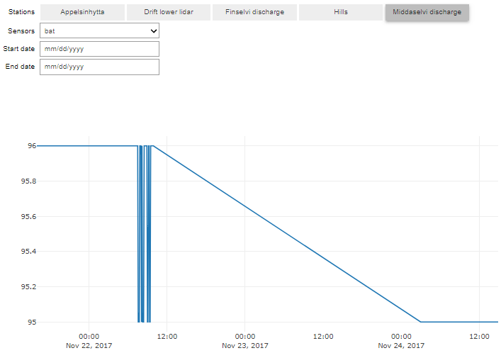

# Interact to select station, variable and time

In our previous lesson, we made an interactive 2D-plot with <a href="https://plot.ly/">Plotly</a> for one Finse Station (Hills) and one variable (sonic temperature) over a chosen period of time (between 1/12/2017 to 1/1/2018). Now we will add the possibility to choose the station, the variable (sensor) and the period of time.

The list of available sensors varies from one station to another and this information is available in `FinseStationsSensors.csv` a comma separated file. This file can be read using `pandas`:

~~~
import pandas as pd
import urllib.request

url='https://raw.githubusercontent.com/annefou/jupyter_dashboards/gh-pages/data/FinseStationsSensors.csv'
# Download the file from `url`, save it FinseStationsSensors.csv
geojson_filename, headers = urllib.request.urlretrieve(url, 'FinseStationsSensors.csv')

StationsSensors=pd.read_csv("FinseStationsSensors.csv")
StationsSensors

# Create a dictionary where for each station we get the list of available sensors
sensors = StationsSensors.groupby('Station name')['Sensor'].apply(list).to_dict()
~~~
{: .language-python}

The variable `sensors` is a python dictionary and contains:

~~~
{'Appelsinhytta': ['ds2_meridional',
  'ds2_dir',
  'ds2_zonal',
  'ds2_speed',
  'ds2_temp',
  'bat',
  'ds2_gust'],
 'Drift lower lidar': ['rssi',
  'ds2_zonal',
  'ds2_temp',
  'ds2_speed',
  'bat',
  'ds2_dir',
  'ds2_gust',
  'ds2_meridional'],
 'Finselvi discharge': ['ctd_temp', 'bat', 'ctd_depth', 'ctd_cond'],
 'Hills': ['rssi',
  'ds2_speed',
  'bat',
  'ds2_gust',
  'ds2_temp',
  'ds2_zonal',
  'ds2_meridional',
  'ds2_dir'],
 'Middaselvi discharge': ['bat']}
~~~
{: .output}

We need 2 buttons (stations and sensors) and two date pickers:

~~~
import ipywidgets as widgets

# Create buttons for Stations and Sensors
stationW = widgets.ToggleButtons(options=list(sensors.keys()), description='Stations', orientation='horizontal')
init = stationW.value
sensorW = widgets.Dropdown(options=sensors[init], description='Sensors')

# Create buttons for start and end dates
startDate = widgets.DatePicker(
    description='Start date',
    disabled=False
)
# Create buttons for start and end dates
endDate = widgets.DatePicker(
    description='End date',
    disabled=False
)
~~~
{: .language-python}

Then we create a function to plot our data (using what we had done in our previous lesson):

~~~
import requests
from pandas.io.json import json_normalize
import plotly.offline as py
import plotly.graph_objs as go

py.init_notebook_mode()

URL = 'http://hycamp.org/wsn/api/query/'
token = 'dcff0c629050b5492362ec28173fa3e051648cb1'
headers = {'Authorization': 'Token %s' % token}

def getFinseStation(station, sensor, start_date, end_date):
        if start_date is not None:
            tst__gte = start_date.strftime('%Y-%m-%dT%H:%M:%S+00:00')
        else:
            tst__gte = None
        if end_date is not None:
            tst__lte = end_date.strftime('%Y-%m-%dT%H:%M:%S+00:00')
        else:
            tst__lte = None
        params  = {
            'limit': 10000,
            'offset': 0,
            'mote': station,
            'xbee': None,
            'sensor': sensor,
            'tst__gte': tst__gte,
            'tst__lte': tst__lte,
            }
        r = requests.get(URL, headers=headers, params = params)
        if r.status_code == 200:
            if r.json()['count'] > 0:
                data = r.json()['results']
                FinseStations = json_normalize(data)       
                FinseStations['timestamp'] = pd.to_datetime(FinseStations.epoch, unit='s')
                return FinseStations
            else:
                return None
        else:
            print("Data not available")
            return None
~~~
{: .language-python}

And a function called `select_sensor` to display the right list of sensors depending on the selected station:

~~~
# Define function to display the list of available sensor for a given station
# The prototype of the function is defined in the API and is a dictionary
# key 'new' contains the the new value of the associated widget
def select_sensor(change):
    sensorW.options = sensors[change['new']]
~~~
{: .language-python}

And another function to display our plot according to the chosen station, sensor and start_date and end_date:

~~~
# Define a function to plot
def plot_sensor(station,sensor, start_date, end_date):
    station_id=StationsSensors.loc[StationsSensors['Station name'] == station, 'Waspmote_id'].iloc[0]
    FinseStation = getFinseStation(station_id, sensor, start_date, end_date)
    if FinseStation is not None:
        # simple timeserie plot
        ds = FinseStation.loc[FinseStation['sensor'] == sensor]
        # Use plotly to plot
        data = [go.Scatter(x=ds.timestamp, y=ds.value)]
        py.iplot(data)
    else:
        print("Data not available")
~~~
{: .language-python}

Finally we need to trigger actions when:
- a user select a station, we need to display the corresponding list of Sensors
- there is any changes (station, sensor, start_date or end_date), we need to make a new plot

~~~
stationW.observe(select_sensor, names="value")
interact_plot = widgets.interact(plot_sensor, start_date = startDate, end_date = endDate,
                    station = stationW,
                    sensor= sensorW);
~~~
{: .language-python}

- To display the corresponding list of sensors, we `observe` changes in `stationW`. As soon as there is a change, the callback `select_sensor` is called and update the list of sensors.

- With `interact`, the callback `plot_sensor` is called and we pass 4 arguments:
    * start_date (and we pass startDate Widget)
    * end_date (passing endDate Widget)
    * station (stationW widget)
    * sensor (sensorW widget)

> ## interact versus interact_manual
>
> When your function (here `plot_sensor`) is slow, you may use `interact_manual` instead of `interact`.
> Change `interact` by `interact_manual` and discuss the difference.
>
{: .challenge}

 

# Overlay Norwegian Meteorological Service Weather stations

 

Duplicate the jupyter dashboard you made in the previous lesson (remember it as called `dashboard_finse.ipynb`) into a new jupyter dashboard called `dashboard_finse_metno.ipynb`.

For this exercise, we will be adding Weather Stations from the Norwegian Meteorological institute on our map.

The data we are willing to add are freely available from [https://data.met.no](https://data.met.no) but to get access you need to get a `client identifier`.

### Get your client identifier from [https://data.met.no/auth/requestCredentials.html](https://data.met.no/auth/requestCredentials.html)

Use your green sticky note when you have your client identifier or you red sticky note if you need help.

In all the example below, you need to set the variable `client_id` to the value you received:

~~~
client_id = '11111111-1111-1111-1111-111111111111'
~~~
{: .language-python}

Make sure you replace with a valid `client_id`. For more information on how to create requests see the documentation  [here](https://frost.met.no/concepts#getting_started).

### Overlay Station locations on our map

Now let's download data from all stations located within a polygon (longitude latitude, ...):

~~~
 import folium
 import requests

 # Update it to your own client_id
 client_id = '11111111-1111-1111-1111-111111111111'

 types='SensorSystem'

 # request all stations within a polygon (longitude latitude, ...)
 polygon = 'POLYGON((6.9 60.35,6.9 60.7,8.16 60.7, 8.16 60.35, 6.9 60.35))'
 # issue an HTTP GET request
 r = requests.get(
        'https://frost.met.no/sources/v0.jsonld',
        {'types': types,
        'geometry': polygon},
        auth=(client_id, '')
    )
~~~
{: .language-python}

Details on the <a href="https://frost.met.no/concepts">frost API</a> are out of scope and to get data, we followed the <a href="https://frost.met.no/langex_python">provided example</a>.
More examples (for R) can be found <a href="https://frost.met.no/examples">here</a>.

In our code, our HTTP request to the <a href="https://frost.met.no/index.html">frost.met.no</a> returns a JSON response. We can then use `pandas` python package as demonstrated in the code below.

 Let's print our data to get an overview of what we have. For further manipulation, we first convert the field
 “validFrom” from a string to a date (using datetime) and we use `json_normalize` (from pandas) to “normalize” our semi-structured JSON data into a flat table (easier to plot and manipulate):

~~~
 from pandas.io.json import json_normalize
 from datetime import datetime
 from beakerx import *

 data = r.json()['data']>
 for element in data:
         value = element['validFrom']
         element['validFrom'] = datetime.strptime(value, "%Y-%M-%d")
 json_normalize(data)
~~~
{: .language-python}

Now, we would like to print some metadata (station name, its location, etc.) when a user click on the station icon on the map (as it was done for Finse Apline Weather Stations):

~~~
 for item in r.json()['data']:
        latitute=''
        longitude=''
        county=''
        municipality=''
        if 'geometry' in item:
            latitude = item['geometry']['coordinates'][1]
            longitude = item['geometry']['coordinates'][0]
            location = [latitude,longitude]
        if 'municipality' in item:
            municipality = item['municipality']
        if 'county' in item:
            county = item['county']
        html = """
      <h4>ID: """ + item['id'] + """</h4>
      <h4>Name: """ + item['name'] + """</h4>

      <h4>Latitude: """ + str(latitude) + """</h4>
      <h4>Longitude: """ + str(longitude) + """</h4>
      <h4>Municipality: """ + str(municipality) + """</h4>
      <h4>County: """ + str(county) + """</h4>
      <h4>Country: """ + str(item['country']) + """</h4>
    """
        iframe = folium.IFrame(html=html, width=300, height=200)
        popup = folium.Popup(iframe, max_width=2650)
        folium.Marker(location, popup=popup,  icon=folium.Icon(color='blue',  icon='cloud')).add_to(map)
~~~
{: .language-python}

 <iframe width="600" height="400" src="../files/map_finse_metno.html" frameborder="0" allowfullscreen></iframe>

We used a different color (blue) to distinguish between Finse Alpine Research Stations and Official Norwegian Meteorologial Service Weather Stations.

### Add groups to select Finse Alpine Research Centre stations or MetNo Weather Stations

In both cases (Finse Alpine Research Station and Norwegian Meteorological Service Weather Stations), we added each station as a `Marker` to our `map` object with `add_to`. To split our stations in two distinct groups that we can select/unselect, we need:

- Create two groups (one for each type of stations)
- Add markers to their corresponding group and not to `map`
- Add each groups to `map` and allow to select stations from each group

~~~
# Create two groups:
# Group-1: Finse Alpine Research Centre Stations
# Group-2: Norwegian Meteorological Service Weather Stations

group_1 = folium.FeatureGroup(name='Finse Stations')
group_2 = folium.FeatureGroup(name='MetNo Stations')

# Add group_1 and group_2 to map
group_1.add_to(map)
group_2.add_to(map)
folium.LayerControl().add_to(map)
~~~
{: .language-python}

Then we add Markers to group_1 or group_2 and not to map i.e. we replace

~~~
folium.Marker(location, popup=popup,  icon=folium.Icon(color='green',  icon='ok-sign')).add_to(map)
~~~
{: .language-python}

by

~~~
folium.Marker(location, popup=popup,  icon=folium.Icon(color='green',  icon='ok-sign')).add_to(group_1)
~~~
{: .language-python}

or
~~~
folium.Marker(location, popup=popup,  icon=folium.Icon(color='blue',  icon='cloud')).add_to(map)
~~~
{: .language-python}

by

~~~
folium.Marker(location, popup=popup,  icon=folium.Icon(color='blue',  icon='cloud')).add_to(group_2)
~~~
{: .language-python}

 <iframe width="600" height="400" src="../files/map_finse_metno_control.html" frameborder="0" allowfullscreen></iframe>

 
# Other packages

The purpose of this lesson was not to give you a full overview of existing packages you can use for interactive plotting and rather show you some of its principle. However, you may be interested by the following packages:
<ul>
<li>Matplotlib<ul>
<li><a href="https://seaborn.pydata.org/">seaborn</a>: statistical data visualization</li>
<li><a href="http://pandas.pydata.org/">Pandas</a>: Dataframes</li>
<li><a href="https://networkx.github.io/">networkx</a>: Graphs</li>
<li><a href="https://plotnine.readthedocs.io/en/stable/">plotnine</a>: Python implementation of the grammar of graphics</li>
<li><a href="https://github.com/DistrictDataLabs/yellowbrick">Yellow Brick</a></li>
<li><a href="https://github.com/reiinakano/scikit-plot">scikit-plot</a></li>
</ul>
</li>
<li><a href="https://github.com/bokeh/datashader">Datashader</a>: Turns even the largest data into images</li>
<li><a href="https://github.com/maartenbreddels/vaex">Vaex</a>: visualize and explore large (~billion rows/objects) tabular datasets interactively</li>
<li><a href="http://holoviews.org/">Holoviews</a></li>
<li>Javascript<ul>
<li><a href="https://plot.ly/python/">plotly</a></li>
<li><a href="http://bokeh.pydata.org/en/latest/">bokeh</a></li>
<li><a href="https://github.com/santosjorge/cufflinks">cufflinks</a></li>
<li><a href="https://github.com/bloomberg/bqplot">bqplot</a>: Plotting library for IPython/Jupyter Notebooks</li>
<li><a href="https://github.com/jovyan/pythreejs">pythreejs</a>: A Jupyter - ThreeJS bridge</li>
<li><a href="https://github.com/ellisonbg/ipyleaflet">ipyleaflet</a>: IPython Widget for Leaflet Maps</li>
<li><a href="https://github.com/maartenbreddels/ipyvolume">ipyvolume</a></li>
</ul>
</li>
<li>OpenGL<ul>
<li><a href="http://vispy.org/">Vispy</a>: interactive scientific visualization</li>
<li><a href="https://glumpy.github.io/">Glumpy</a>: scientific visualization</li>
</ul>
</li>
<li>Specification languages:<ul>
<li><a href="https://github.com/vega/vega">Vega</a></li>
<li><a href="https://vincent.readthedocs.io/en/latest/">Vincent</a>: A Python to Vega Translator</li>
<li><a href="https://vega.github.io/vega-lite/">Vega Lite</a></li>
<li><a href="https://altair-viz.github.io/">Altair</a></li>
<li><a href="https://github.com/information-field-theory/d3po">d3po</a>: Denoising, Deconvolving, and Decomposing Photon Observations</li>
</ul>
</li>
</ul>

  
  
