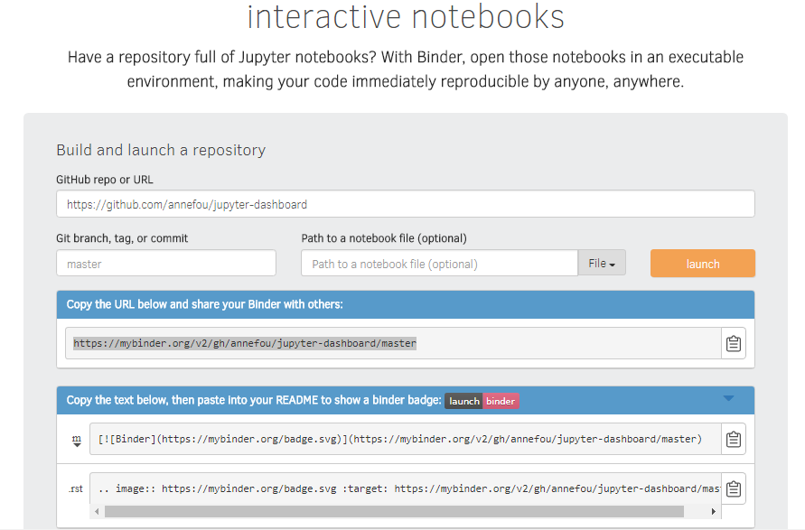

> ## Important notice
> This lesson has been taken from [https://reproducible-science-curriculum.github.io/sharing-RR-Jupyter/](https://reproducible-science-curriculum.github.io/sharing-RR-Jupyter/)
> and is distributed under the <a href="https://creativecommons.org/licenses/by/4.0/">Creative Commons Attribution license</a>.
> The following is a human-readable summary of (and not a substitute for) the <a href="https://creativecommons.org/licenses/by/4.0/legalcode">full legal text of the CC BY 4.0 license</a>.
{: .callout}

# Reproducible computing environments with Binder

## A short intro on Binder

Authors: Chris Holdgraf, M Pacer

[Slideshow](https://reproducible-science-curriculum.github.io/sharing-RR-Jupyter/slides/02-intro_to_binder.slides.html#/)

## Your jupyter dashboards in mybinder

### Preparing your github repository for Binder

We would like to publish all the codes in our repository with Binder. To be Binder-compliant,
we need to add configurations files (one or more text files) that specify the requirements for building your project’s code:

#### Sharing our Python environment (environment.yml)

This approach is recommended when all the additional packages/libraries you need are part of conda. Be aware that `conda` is a source package management system and is not only used for `python`. Many packages/libraries, independent of python/R are made available via conda, so the best is to first check online whether your package is already available via conda.

~~~
name: jupyter_dashboards_workshop
channels:
  - tim_shawver
  - conda-forge
  - defaults
dependencies:
  - python>3.6
  - notebook>5.2
  - jupyter_dashboards
  - jupyter_dashboards_bundlers
  - folium
  - ipywidgets=7
  - qgrid
  - plotly
  - beakerx
~~~
{: .language-bash}

This file must be placed in the root directory of your reprository on Gitub.

Test and launch your Github repository with<a href="https://mybinder.org/">Binder</a>.

#### Sharing our complete workflow

Using environment.yml, we can run all our notebooks except those dealing with the <a href="https://models.slf.ch/p/snowpack/">SNOWPACK</a> model (snow and land-surface model). To share our computational environment, <a href="https://models.slf.ch/p/snowpack/">SNOWPACK</a> needs to be installed. <a href="https://models.slf.ch/p/snowpack/">SNOWPACK</a> is not available as a `conda` package so we will need to install it manually.

- apt.txt : contains all the debian packages that should be installed for installing and running <a href="https://models.slf.ch/p/snowpack/">SNOWPACK</a>. C/C++ GNU compilers are available (SNOWPACK is written in C++) but to compile <a href="https://models.slf.ch/p/snowpack/">SNOWPACK</a>, we need also <a href="https://cmake.org/overview/">cmake</a> which is not available by default:

~~~
cmake
~~~
{: .language-bash}

- environment.yml (same as before i.e. with all the conda packages we need)

- postBuild

~~~
#!/bin/bash
# Installation of SNOWPACK a multi-purpose snow and land-surface model, which focuses on a detailed description of the mass and energy exchange between the snow, the atmosphere and optionally with the vegetation cover and the soil. It also includes a detailed treatment of mass and energy fluxes within these media.

export PREFIX="$(python -c 'import sys; print(sys.prefix)')"

work="$PWD"
# Get METEOI library and install:
wget https://models.slf.ch/p/meteoio/downloads/get/MeteoIO-2.7.0-src.tar.gz
tar zxf MeteoIO-2.7.0-src.tar.gz
cd MeteoIO-2.7.0-src
mkdir build
cd build
cmake ../ -DCMAKE_INSTALL_PREFIX=$PREFIX
make
make install
cd $work

rm -rf MeteoIO*

# Get SNOWPACK source code and install:
wget https://models.slf.ch/p/snowpack/downloads/get/Snowpack-3.4.5-src.tar.gz

tar zxf Snowpack-3.4.5-src.tar.gz
cd Snowpack-3.4.5-src
mkdir build
cd build
cmake ../ -DCMAKE_INSTALL_PREFIX=$PREFIX -DCMAKE_METEOI_ROOT=$PREFIX
make
make install

rm -rf Snowpack*
~~~
{: .language-bash}

> ## Note
> This file must be executable to be used with repo2docker.
> To do this, run the following on Linux/Mac-OSX:
> ~~~
> chmod +x postBuild
> ~~~
> {: .language-python}
>
> On Windows (to be done before you commit your file):
> ~~~
> git update-index --chmod=+x foo.sh
> ~~~
> {: .language-python}
{: .callout}

> ## Launch your computational environment on Binder
>
> - Start your complete computational environment on <a href="https://mybinder.org/">Binder</a>
> - Try to execute your dashboard
> - Check the exectuable called `snowpack` is available in your Binder environment
{: .challenge}

### Publish your dashboards in mybinder

- Create a shareable Binder link
- Update your github repository to display shareable Binder link for each of your dashboards

We make two exercises: one with environment.yml (adding conda packages) and one with an entire workflow (apt.txt, environment.yml and postBuild).
