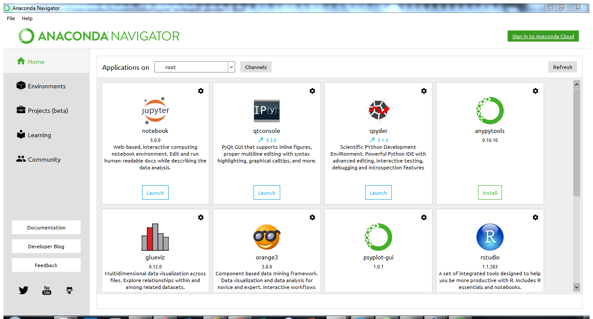
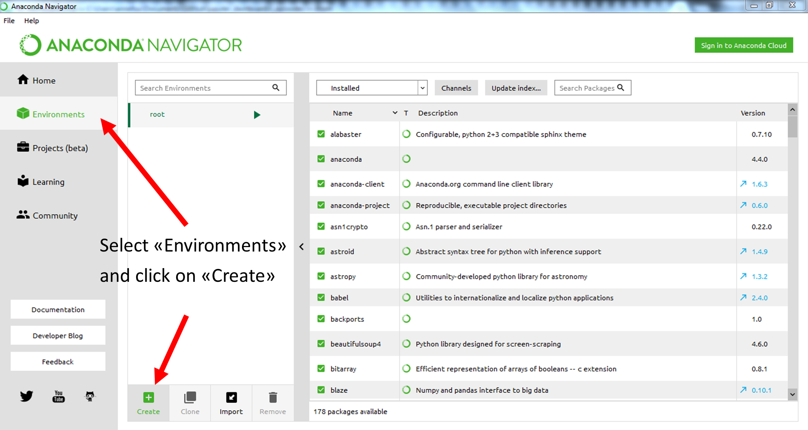

# Prerequisites

For this lesson you would need:

- [Install python anaconda (3.6)](#installing-python) and [Anaconda Navigator ](#installing-anaconda-navigator)
- [Install additional python packages](#installing-additional-python-packages) using the provided file <a hred="https://raw.githubusercontent.com/annefou/jupyter_dashboards/gh-pages/environment.yml">environment.yml</a>
- [A github account](#github-account) (register <a href="https://github.com/">here</a> if necessary)
- [Install Docker](#docker-installation) (try but don't worry if you do not manage to install it)

# Installing Python

[Python](http://python.org/) is a popular language for research computing, and great for general-purpose programming as well. Installing all of its research packages individually can be a bit difficult, so we recommend Anaconda, an all-in-one installer. Regardless of how you choose to install it, please make sure you install **Python version 3.6**. We will teach Python using the [Jupyter Notebook](http://jupyter.org/), a programming environment that runs in a web browser. For this to work you will need a reasonably up-to-date browser. The current versions of the Chrome, Safari and Firefox browsers are all supported (some older browsers, including Internet Explorer version 9 and below, are not).

## Windows

[Video tutorial](https://www.youtube.com/watch?v=xxQ0mzZ8UvA)

1. Open <a href="https://www.anaconda.com/download/">https://www.anaconda.com/download/</a> with your web browser.
2. Download the Python 3 installer for Windows.
3. Install Python 3 using all of the defaults for installation except make sure to check that the Anaconda distribution is the default Python.

## Mac OSX

[Video tutorial](https://www.youtube.com/watch?v=TcSAln46u9U)

1. Open <a href="https://www.anaconda.com/download/">https://www.anaconda.com/download/</a> with your web browser.
2. Download the Python 3 installer for OS X.
3. Install Python 3 using all of the defaults for installation.
    * If you want to install Anaconda in your home directory (“for me only”), and the respective dialog when it initially appears prohibits this choice, change the location to system-wide (“for every user”), and then change it back. (This is a bug in the installer that can manifest on some versions of MacOSX.)

## Linux

1. Open <a href="https://www.anaconda.com/download/">https://www.anaconda.com/download/</a> with your web browser.
2. Download the Python 3 installer for Linux.
3. Install Python 3 using all of the defaults for installation. (Installation requires using the shell. If you aren’t comfortable doing the installation yourself stop here and request help at the workshop.)
4. Open a terminal window.
5. Type:

~~~
 bash Anaconda3-
~~~
{: .language-bash}

and then press tab. The name of the file you just downloaded should appear.

Press enter. You will follow the text-only prompts. When there is a colon at the bottom of the screen press the down arrow to move down through the text. Type yes and press enter to approve the license. Press enter to approve the default location for the files. Type yes and press enter to prepend Anaconda to your PATH (this makes the Anaconda distribution the default Python).

# Installing Anaconda Navigator

One of the useful things about Anaconda Python is its tools for Python **package management** and **project environments**. The core tool for this is the command-line utility **conda**. However, there is also a GUI tool called "Anaconda Navigator".

As part of this workshop, we will learn how to use [Anaconda navigator](https://anaconda.org/anaconda/anaconda-navigator) to manage our Python environment and for this setup section, you only need to check Anaconda Navigator is available on your laptop. Do not hesitate to contact us if you have any problems. We will be able to help you with the installation during the workshop so do not worry!

## Test your Installation

Launch "Anaconda Navigator" from your menu. This should work on any operating system (Windows, Mac-OSX and Linux) and a window should pop up:

On Mac-OSX or Linux, you may want to launch it from the command line:

~~~
$ anaconda-navigator
~~~
{: .language-bash}

 

> ## Credits
> This installation tutorial is taken from [Software Carpentry](http://swcarpentry.github.io/workshop-template/#setup)
{: .callout}

# Installing additional python packages

We will be using **Anaconda Navigator** to install all the python packages we will be using for this lesson:

Before launching Jupyter notebook and creating our first notebook we will:

1. Download <a href="https://raw.githubusercontent.com/annefou/jupyter_dashboards/gh-pages/environment.yml">environment.yml</a> to your local computer
2. Start Anaconda navigator (Windows, Max-OSX and Linux)
3. Create a new conda "jupyter_dashboards_workshop" environment using environment.yml
4. Test your installation

### Download <a href="https://raw.githubusercontent.com/annefou/jupyter_dashboards/gh-pages/environment.yml">environment.yml</a> to your local computer

- Right click on the following link  <a href="https://raw.githubusercontent.com/annefou/jupyter_dashboards/gh-pages/environment.yml">environment.yml</a> and "save as link" it to your local computer
- Make sure you know where you save it! (Check your "Downloads" folder).

### Start Anaconda navigator

#### WINDOWS

After you install Anaconda on Windows, start Navigator by:

Clicking the Anaconda Navigator desktop app from the start menu. Or by opening an Anaconda Prompt from the start menu and running the command anaconda-navigator.

#### MacOS

After you install Anaconda on macOS, start Navigator by:

Clicking the Navigator menu item that was automatically added to your menu.

Or open Launchpad, click Terminal or iTerm and enter the command anaconda-navigator.

~~~
$ anaconda-navigator
~~~
{: .language-bash}

#### Linux

After you install Anaconda on Linux, you can start Anaconda Navigator by opening a Terminal window and running the command "anaconda-navigator":

~~~
$ anaconda-navigator
~~~
{: .language-bash}

Anaconda does not add shortcuts for Linux automatically because different Linux distributions have different systems for adding menu or desktop shortcuts. You can use your operating system to create desktop and/or main-menu shortcuts that run the command anaconda-navigator.

For more information on how to start Anaconda Navigator look [here](https://docs.continuum.io/anaconda/navigator/getting-started).

### Create a new conda environment "jupyter_dashboards_workshop"

#### From the command line (Mac OSX and Linux)

Open a Terminal and type:
~~~
conda env create -f environment.yml
~~~
{: .language-bash} 

#### From `Anaconda Navigator`

- Click on tab "Environments" (menu on the left hand side) and then "Import"

- Click on the "Folder" icon and browse your file to select **environment.yml**.

- Click on "Import". This stage may take a few minutes so be patient...

### Start jupyter notebook

We want to start a new jupyter notebook using our newly created conda environment. To select "jupyter_dashboards_workshop" conda environment:

- Click on "Home" (left menu)
- Select "jupyter_dashboards_workshop" in "Applications on" (see figure below)
- Launch jupyter notebook ("Launch" button)

Jupyter starts in your default browser at the address [http://localhost:8888/tree](http://localhost:8888/tree) and shows the tree (directories) from the root directory (here is root directory is to be understood from the installation location of Anaconda). It may vary from one laptop to another but you should not worry about it.

When clicking on "New" (right hand side) as shown on the Figure below:

 You should be able to select "Python 3". That's all you need for the workshop!

> ## Default browser
>  You may need to change the default browser for starting your jupyter notebook. All the examples in this lesson have been tested with [Google chrome](https://www.google.com/chrome/browser/desktop/index.html?brand=CHBD&gclid=CjwKCAiA15vTBRAHEiwA7Snfc8Ly7Kz3VH-sKSABkCHsiAhviP1ZJzyzV5wUPasjHs27d_0PcESFkhoCOskQAvD_BwE)
{: .callout}

# Github Account

### Go to the GitHub Homepage

> ## Important notice
> This setup instruction are from [https://reproducible-science-curriculum.github.io/sharing-RR-Jupyter/](https://reproducible-science-curriculum.github.io/sharing-RR-Jupyter/)
> and is distributed under the <a href="https://creativecommons.org/licenses/by/4.0/">Creative Commons Attribution license</a>.
> The following is a human-readable summary of (and not a substitute for) the <a href="https://creativecommons.org/licenses/by/4.0/legalcode">full legal text of the CC BY 4.0 license</a>.
{: .callout}

To use GitHub one needs to register for a (free) account. To register for a GitHub account we need to:

1. Open a web browser
2. Navigate to [github.com](https://github.com)

We should see the the web page below.

**Note**: _If you already have a GitHub account you do __NOT__ need to create a new one. Please skip this step._

### To create a GitHub account

- On the GitHub homepage enter:

    - a username
    - an email address
    - a password

- Click the green _Sign up for GitHub_ button.

An example is shown in the screenshot below.

We are asked to confirm the email address that we used to sign. Please confirm the email address.

**Select a plan**

We have to choose a plan that we would like to use. We will use the personal (default) plan.

Click on _Continue_.

**Completing our signup**

We can select any options we would like (on none).

Click _Submit_ to complete our `Github` account setup.

# Installation of Docker

On some laptops, installing docker may be tricky so **don't worry if you don't manage to install docker on your computer before the workshop!**.

## Docker installation

Follow instructions depending on your Operating system:

- <a href="https://docs.docker.com/engine/installation/windows/">Windows</a>
- <a href="https://docs.docker.com/engine/installation/mac/">Mac OS X</a>
- <a href="https://docs.docker.com/engine/installation/linux/">Linux</a>

## What’s Docker Toolbox? Do I need it?

If your OS does not meet the requirements of Docker for Windows or Docker for Mac you will need to install <a href="https://www.virtualbox.org/">VirtualBox</a> and <a href="https://www.docker.com/products/docker-toolbox">Docker Toolbox</a>.
